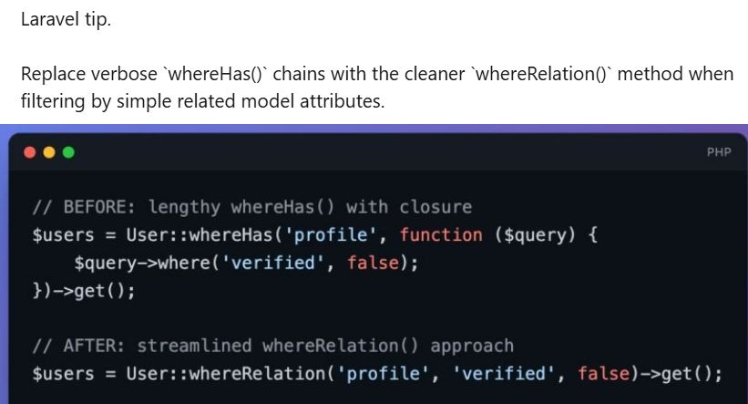

Laravel devs love their shortcuts. Tighter syntax, less boilerplate it's satisfying to trim down a few lines. But let's be honest: just because code is shorter doesn't mean it's better. When you're working with a team and the specs are always shifting, clear code always wins.

I recently came across Laravel tip suggesting we should replace `whereHas()` with `whereRelation()` for cleaner code. The example went like this:

```php
// BEFORE
$users = User::whereHas('profile', function ($query) {
    $query->where('is_verified', false);
})->get();

// AFTER
$users = User::whereRelation('profile', 'is_verified', false)->get();
```

You can check the original [post](https://www.linkedin.com/posts/povilas-korop-laravel-developer_laravel-tip-replace-verbose-wherehas-activity-7412443059923292160-J7nr/) if you want the full breakdown.



Alright, here's where I land on this advice.

The tip isn't wrong, but presenting `whereRelation()` as a *better* alternative is misleading. It's just syntactic sugar. And honestly, in a real project, that surface-level "cleanliness" can backfire.

## The Real Problem: Readability and Intent

Here's what I actually use in production:

```php
$users = User::query()
    ->whereHas('profile', fn(Builder $query) => $query->where('is_verified', false))
    ->get();
```

Why is this better? Because **it communicates intent clearly**.

When you see `whereHas()`, you immediately understand:

- Relationship is being filtered
- Logic lives inside that relationship scope
- More conditions can be added naturally

*Note: I'm using arrow functions here for conciseness, but that's a separate improvement, you could use them with either method. The key distinction is the method itself.*

## Where whereRelation() Falls Short

The problem with `whereRelation()` is that it obscures what's actually happening. It looks like a simple column filter, but under the hood it's executing a subquery against a related table.

```php
->whereRelation('profile', 'is_verified', false)->get();
```

This reads like filtering a direct column on `users`, not constraining a relationship. That's misleading.

And if you need more than one condition? With `whereHas()`, you just add them:

```php
->whereHas('profile', fn(Builder $query) => $query
    ->where('is_verified', false)
    ->whereNotNull('phone')
    ->where('age', '>', 18)
)
```

With `whereRelation()`, this becomes awkward or impossible. You'd need multiple chained calls or give up and switch back to `whereHas()` anyway.

## When whereRelation() Is Actually Fine

I'm not totally against `whereRelation()`. It works fine for stuff like:

- Quick admin reports
- Throwaway scripts
- Tiny filters that'll never get more complex

For example:

```php
User::query()->whereRelation('profile', 'is_verified', true)->count();
```

That's simple enough. But as soon as your logic gets even a little more complicated, just reach for `whereHas()`. It's clearer and won't confuse your future self or your teammates.

## The Performance Myth

A lot of devs steer clear of  `whereHas()` because someone told them it's slow. That's a different discussion entirely and usually the problem is missing indexes, or it's time to go with the query builder, but not the method itself.

But here's a practical issue: imagine you join a new project and get a ticket saying "the users endpoint is slow." What's your move? Search the codebase for relationship queries and check if proper indexes exist.

So you search for `whereHas`... and find nothing. Turns out the last dev used `whereRelation()` everywhere. Now you're hunting through method calls that don't look like relation filters at all. `whereHas()` is greppable and obvious. `whereRelation()` hides in plain sight.

## The Consistency Problem

Here's what actually happens in real codebases:

You start simple. Maybe you reach for `whereRelation()`:

```php
User::query()->whereRelation('profile', 'is_verified', true)->get();
```

But business logic always changes. Suddenly you need second condition, so you switch to `whereHas()`:

```php
User::query()->whereHas('profile', fn(Builder $query) => $query
    ->where('is_verified', true)
    ->whereNotNull('phone')
)->get();
```

Now your codebase has both patterns. New folks don't know which one to use. Code reviews become inconsistent. You see `whereRelation()` in one file, `whereHas()` in another, and there's no real reason for it. Teams should agree on one default and deviate only with a reason.

If you just used `whereHas()` from the day one, this never happens. One style, consistent everywhere, and your code is ready when requirements get more complicated.

## Laravel Internals: No Magic Here

Let's be real, `whereRelation()` is just a wrapper around `whereHas()`. It's not smarter, cleaner, efficent, or faster. It only saves you from writing a closure. If you don't believe me, check out the [source code](https://github.com/laravel/framework/blob/master/src/Illuminate/Database/Eloquent/Concerns/QueriesRelationships.php#L440).

That's fine for trivial cases. But for real world app, queries with multiple conditions, maintainability concerns, or any chance of future growth, choosing `whereHas()` isn't old-fashioned it's **more honest about what your code does**.

## My Rule of Thumb

- One condition, zero chance it grows, quick script? Go with `whereRelation()`.
- Anything that matters: business logic, team projects, code you'll revisit use `whereHas()`.

Don't try to save a few keystrokes. Write for the next developer (or yourself in six months) reading the code. `whereRelation()` is a nice shortcut, but don't mistake convenience for clarity. In most real scenarios, `whereHas()` with clean syntax wins for readability, scalability, and honest intent.

## Author's Note

Thanks for sticking around!
Find me on [dev.to](https://dev.to/tegos), [linkedin](https://www.linkedin.com/in/ivan-mykhavko/), or you can check out my work on [github](https://github.com/tegos).

**Notes from real-world Laravel.**
